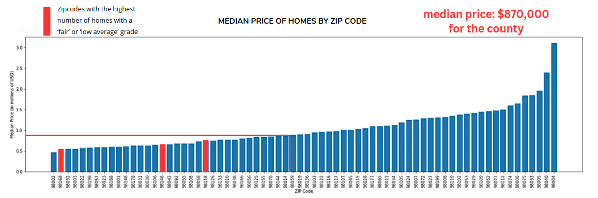
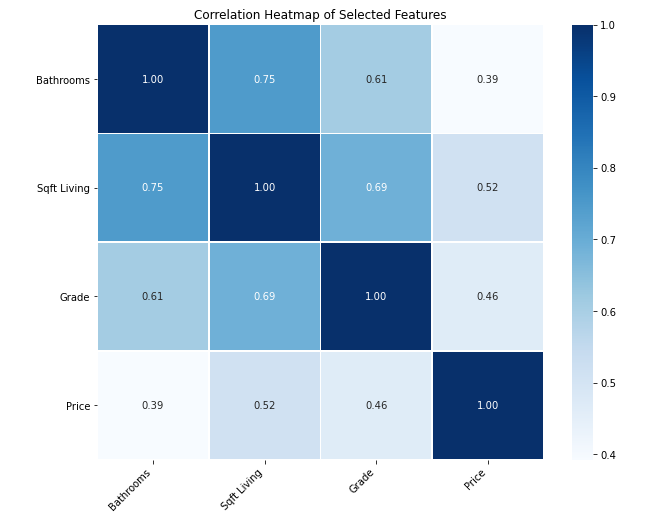

# Coldwell Banker Real Estate Agency Needs Analysis

**Author**: [Adam Marianacci](mailto:adam.marianacci@gmail.com)
 

# Business Understanding

Coldwell Banker wants to buy undervalued homes in certain zipcodes to minimally renovate and sell for a profit. It is my job to find homes that are being listed significanty lower than the median price and look into what variables are causing these lowered prices so that I can properly advise Coldwell Banker on which homes to target. 

# Data Understanding

This project uses the King County House Sales dataset. It contains over 30,000 entries of data related to the sale price of houses, number of bedrooms,bathrooms and floors, square footage, addresses, and more. The main dataframe used in this project only contained roughly 14,000 entries. A limitation of the data was that it is fairly small since we are dealing with predictive modeling. Also the features of the data were strongly correlated with each other (multicollinearity) rather than the target variable. The dataset is suitable for this project because it has information to reveal which homes are truly being undervalued in certain zipcodes. After analyzing the price, location, and other various specifications and amenities of homes I will be able to make informed recommendations to the real estate agency.

King County House Sales dataset: https://raw.githubusercontent.com/learn-co-curriculum/dsc-phase-2-project-v2-5/main/data/kc_house_data.csv

# Data Preperation

In this section I checked for missing values and removed columns that I would not be needing for my analysis. I extracted zipcodes from the addresses and I started sorting homes by zipcodes. I also sorted homes by the median price as well as zipcodes and created a new dataframe this way. I focused on homes in certain zipcodes below the median price for the county. I ran some measures of central tendency and found the median price of homes for the county was $860,000. I set up a train, test, split on my dataframe to prepare for modeling to get results for training and testing data on my features. I created an "evaluate_model" function to look at the root mean squared error, r2 score, and mean absolute error between my training and testing data.


# Modeling

This project uses Linear regression modeling to predict various features of homes against the target variable of price. The feature that had the strongest correlation with price was 'sqft_living' which is the square footage of a home. I built a baseline model from the 2 variables 'sqft_living' and 'price'. I then went on to build 2 other models that added more features such as 'floors', 'bedrooms', 'sqft_patio', etc. against the target variable 'price'. I found that the number of bathrooms and the overall grade of the house also had a strong impact on price along with sqft_living. The results of my modeling can be further explained in the "Evaluation" section.


# Conclusions

The "kitchen sink" model is the best performing model. However this model should really not be used for real world predictions. We need to gather a lot more data (hundreds of thousands more entries) specifically in homes in the low median priced zipcode areas. Ideally looking for data that is not so collinear so that the regression models can be more useful/predictive. However Coldwell Banker can start targeting homes in the low median priced zipcodes. The top zipcodes to focus on would be the '98168', '98146' and the '98118' areas as they are showing homes with the most 'fair' or 'low average' grades that in theory would return profits with minimal renovations.



## Evaluation

The "kitchen sink" model is the best performing model. It has the highest variance of the 3 models but it is still fairly low at 33.2%. It has the lowest root mean squared error of the 3 models at roughly 312,000 (USD) which is still very large. For these reasons the model should not be used for predictive measures. From the model we did learn that one unit of square footage is approximately equal to to about 128 USD in price. A 1 unit increase in grade is approximately equal to 96,000 USD in price which seems high. It also shows that an additional bathroom is equal to about 17,000 USD in price. These are the features that seem to have the biggest impact on price.

## Recommendations

I found that Square footage and Grade were the features most correlated with price. Adding 1 square foot to a home will increase the value by roughly 130 USD. Minimal renovations such as painting, replacing doors and flooring could really improve the Grade of a home which showed roughly a 96,000 USD increase when improving a home by 1 grade which would increase profits. Coldwell Banker should also target homes in the zipcodes that are below the median price for the county. Further they should target homes in the zipcodes that had the most 'fair' and 'low average' grades so that they can apply necessary renovations to increase the value of these homes.

## Limitations

The main limitations of this dataset was that there was a lot of multicollinearity between the features of the homes. The features were more correlated with each other rather than the target variable (price). We could see this after looking at a heatmap (Pearson Correlation Coefficient Matrix) and after running each of the models with training/testing data. Although the Linear Regression models were helpful in getting an idea of how features correlate with price the models did not perform well enough to be predictive. Furter the models were only built off around 14,000 entries of data gathering more (10x) along with using features that were not as collinear with each other would benefit the models predictive capabilities greatly.



## Next Steps

We need a lot more data/records (hundreds of thousands) specifically in the zipcodes below the median price for homes in the county. Ideally trying to find features that do not have a lot of multicolinearity. Also obtaining data on schools in the district as well as crime reports in the county would be helpful as the would definitely have an impact on price. This kind of data would not be correlated with standard features of a home. Also gathering other economic data would be beneficial such as if there are major companies close by for work or other shopping plazas/restaurants nearby and how this would affect the price of homes. 


## For More Information

See the full analysis in the [Jupyter Notebook](https://github.com/adammarianacci/Real_Estate_Analysis/blob/master/notebook.ipynb) or review this [presentation](https://github.com/adammarianacci/Real_Estate_Analysis/blob/master/presentation.pdf).

For additional info, contact Adam Marianacci (mailto:adam.marianacci@gmail.com)


## Repository Structure

```
├── data
├── images
├── README.md
├── presentation.pdf
└── notebook.ipynb
```
